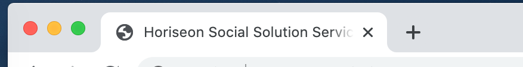
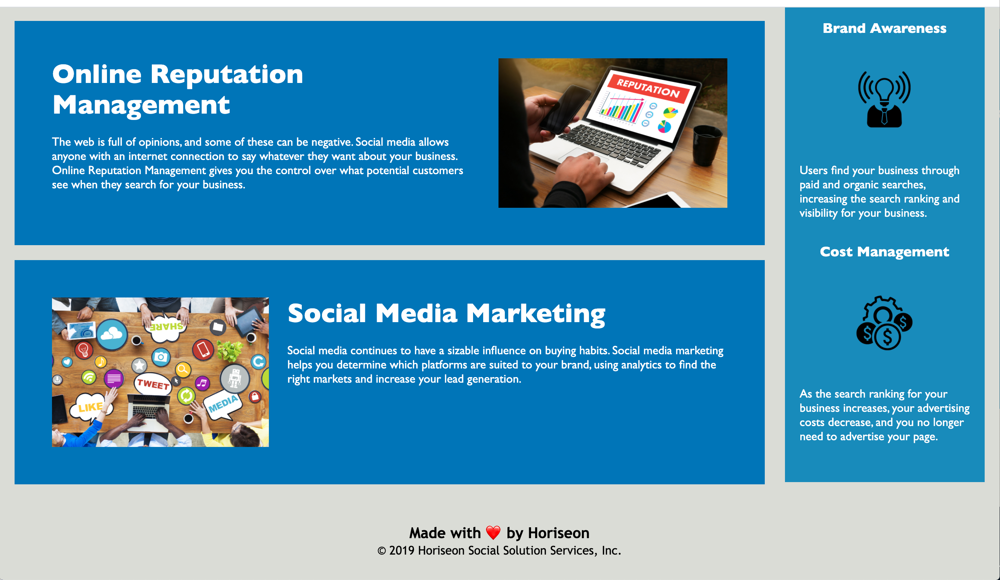
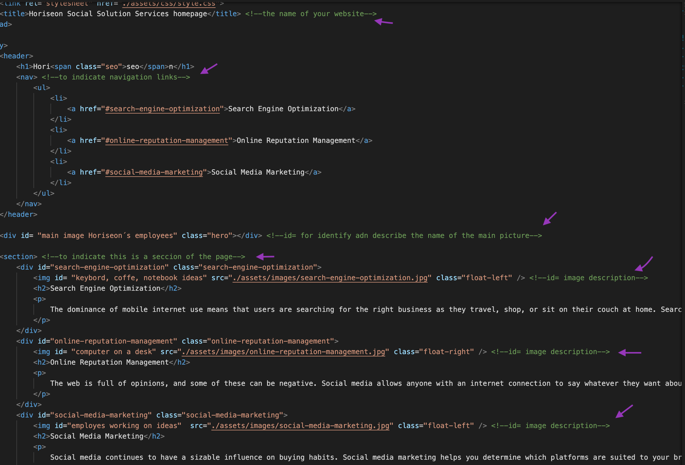
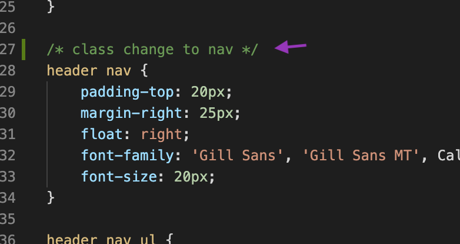

# homeworkunit1

# HORISEON WEBPAGE


Horiseon is marketing agency that wants to refactor an existing site to make it more accessible

 


## Why make it more accessible?

```
Accesibility has become a very important subjet, because is necessary to ensure a site can be used by everyone
```

## Process


The page was designed by using html and the style using CSS, the first aspect to consider was the desing of the page on the browser and then correct the html code and styling

- The page was not named correctly, it was rename by Horiseon Social Solution Services Homepage


- The Search Engine Optimization hyperlink did´t redirect, it was correctly redirect now


- The colours and layot are designed propperly


- In the Html code, it was found some semantic issues, wich were commented in the code with the resolution 


- in the CSS stylesheet, the order of the elements was incorrect, issue was resolve and properly commented



## How does it looks?

go to the link to open on the browser
https://alhelimi.github.io/homeworkunit1/


## Credits 

To solve the needs to this subject, I use the following pages 
- https://www.w3schools.com/
- https://medium.com/
- https://www.dreamhost.com/blog/make-your-website-accessible/
- https://developer.mozilla.org/en-US/docs/Glossary/Semantics

## Challenge

It was my first assignment, therefore it was a challenge and a bit difficult, which were more related to how to deliver it and achieve the main goal, which by te way was also difficult to define 

## Contributing
https://github.com/AlheliMi/homeworkunit1.git
https://alhelimi.github.io/homeworkunit1/

this assignment is not finished yet, I am a code beginner, still exploring the issues that can be resolve, I am sure that something is missing, that I still can not identify as a beinner that I am
Please feel free to pull, comment, add, update, discuss or even just chat @ alhealhe72@hotmail.com 

